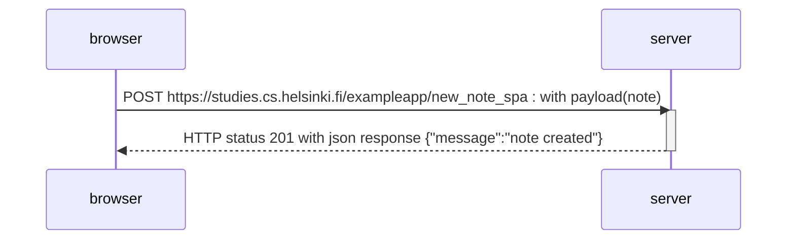

```mermaid
sequenceDiagram
    participant browser
    participant server

    browser->>server: POST https://studies.cs.helsinki.fi/exampleapp/new_note_spa : with payload(note)
    activate server
    server-->>browser: HTTP status 201 with json response {"message":"note created"}
    deactivate server

```